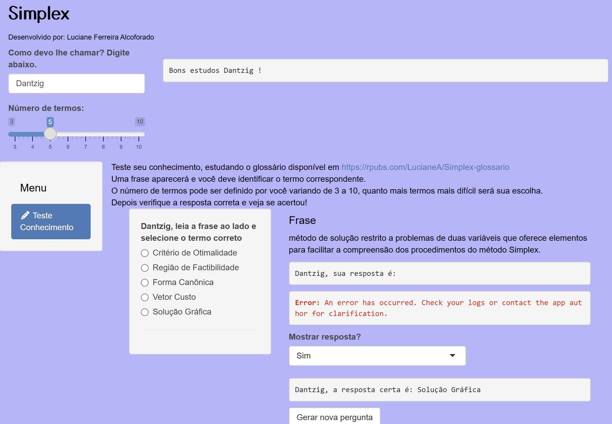
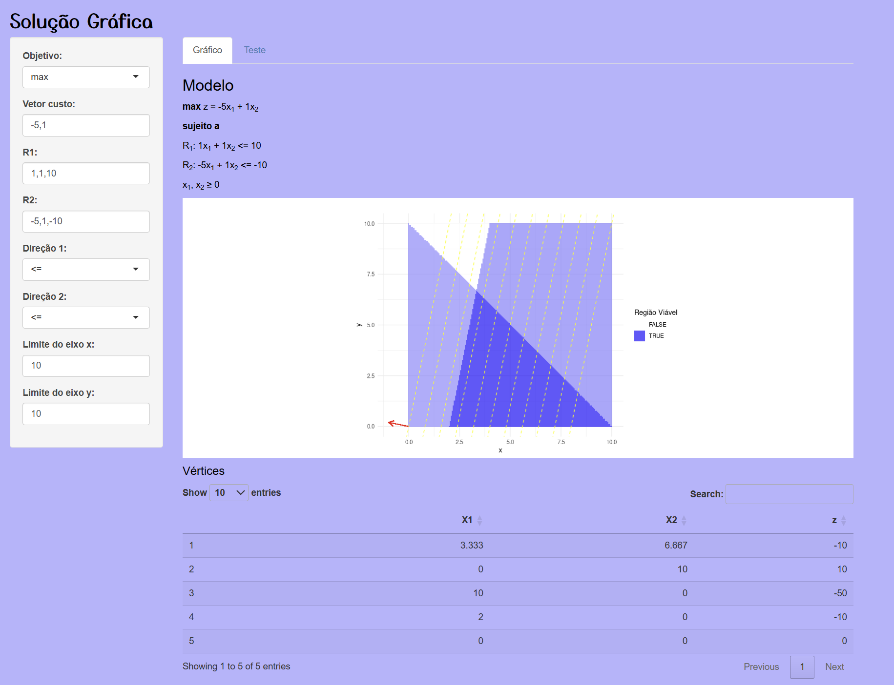
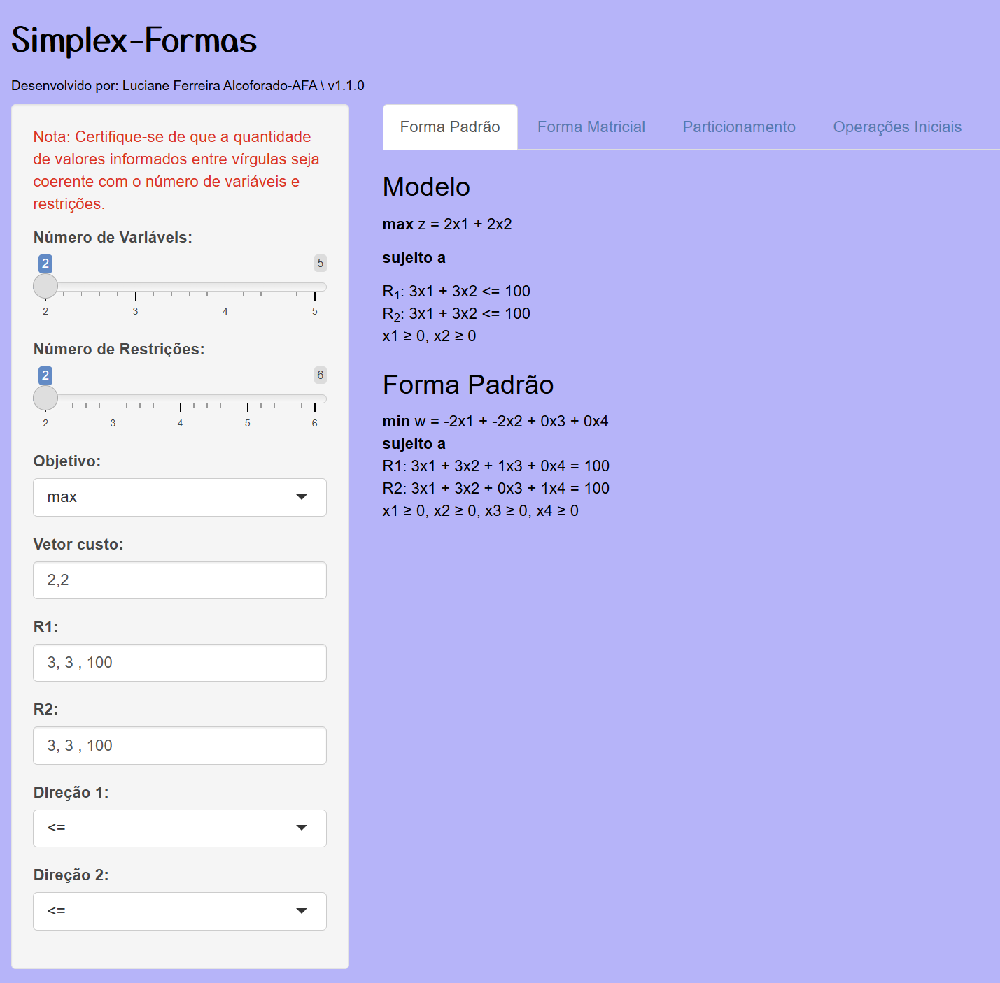
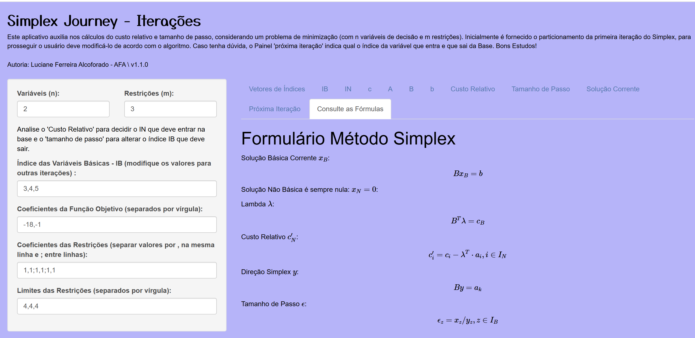

# SimplexJourney
## Autoria de Luciane Alcoforado - AFA

Sistema de aplicativos para ensino aprendizagem de conceitos da programação linear e do algoritmo simplex. Projeto Portaria AFA n. 87/SPPC desenvolvido nos anos de 2023 a 2025.

# Acesso aos aplicativos

-   **Glossário de Termos Técnicos:** Um aplicativo que ajuda os usuários a entenderem os termos técnicos relacionados à programação linear por meio de exercícios interativos, Figura \ref{fig-app-teste}. Acesso em [Teste de Termos Técnicos](https://lucianefalcoforado.shinyapps.io/Teste_Termos/). O Apêndice A apresenta os glossário de termos técnicos utilizado no aplicativo e o Apêndice E contém o código-fonte do aplicativo.

-   **Método da Solução Gráfica:** Um aplicativo que permite aos usuários visualizarem a representação gráfica de restrições, vetor gradiente, curvas de nível, região viável e solução ótima, Figura \ref{fig-app-graficos}. Acesso em [Método da Solução Gráfica](https://lucianefalcoforado.shinyapps.io/SimplexJourney-Grafico/). Os apêndices B e F apresentam o manual de uso e o código-fonte deste aplicativo.

-   **Formulação do Modelo:** Um aplicativo que foca na estruturação do modelo de programação linear, apresentando a forma padrão e os elementos matriciais envolvidos, Figura \ref{fig-app-formas}. Acesso em [Formulação do Modelo](https://lucianefalcoforado.shinyapps.io/Simplex_Formas/). Os apêndices C e G apresentam o manual de uso e o código-fonte deste aplicativo.

-   **Método Simplex Revisado:** Um aplicativo que auxilia nas iterações do método Simplex, permitindo a montagem e manipulação dos elementos matriciais, Figura \ref{fig-app-iteracoes}. Acesso em [Método Simplex Revisado](https://lucianefalcoforado.shinyapps.io/Simplex_iteracoes/). Os apêndices D e H apresentam o manual de uso e o código-fonte das duas versões deste aplicativo.

